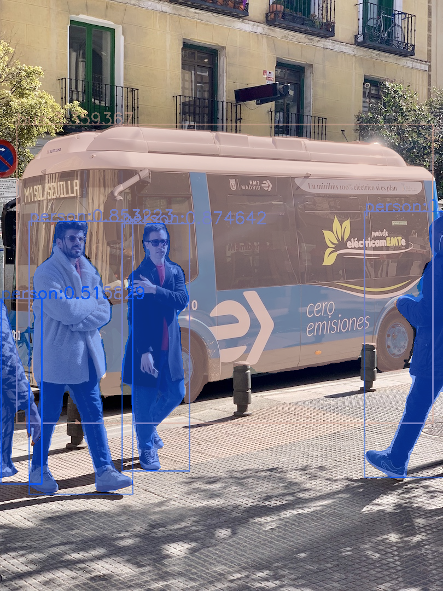
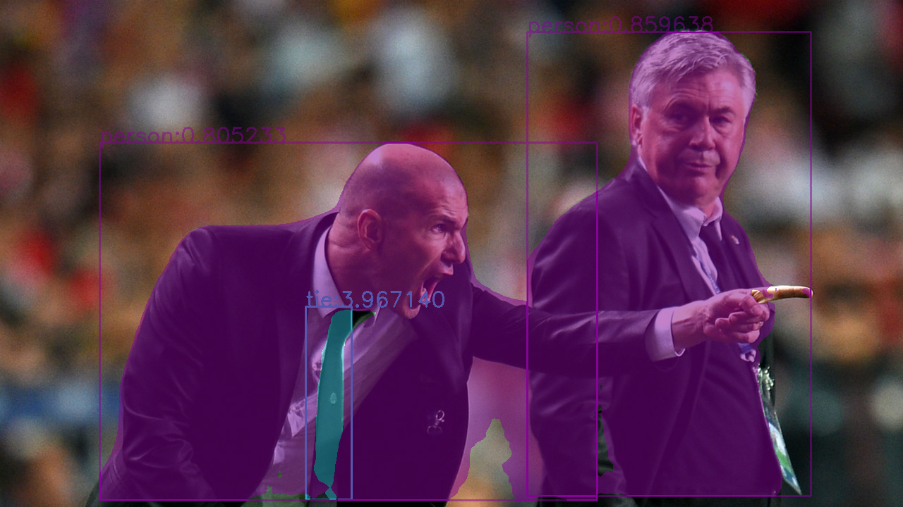

# yolov5-seg-opencv-onnxruntime-cpp
使用opencv-dnn部署yolov5实例分割模型
基于6.2版本的yolov5:https://github.com/ultralytics/yolov5

**OpenCV>=4.5.0**<br>
**ONNXRuntime>=1.9.0,** (Maybe the earlier version of onnxruntime is also possible, but I didn't test it)
```
# for oprncv
python export.py --weights yolov5s-seg.pt --img [640,640] --include onnx --opset 12
# for onnxruntime
python export.py --weights yolov5s-seg.pt --img [640,640] --include onnx  #static
python export.py --weights yolov5s-seg.pt  --batch-size bs-number --dynamic --include onnx  #dyamic
```
#### 2023.01.11 更新：
+ 目前opencv4.7.0的版本会有问题（https://github.com/opencv/opencv/issues/23080) ，如果你是opencv4.7.0的版本，你需要在```net.forward()``` 前面加上```net.enableWinograd(false);```来关闭Winograd加速。
#### 2023.09.20更新<br>
+ 新增模型路径检查，部分issue查了半天，发现模型路径不对。
+ 计算mask部分bug修复，此前如果输入大小非640的话，需要同时设置头文件和结构体才能完成检测，但是大部分人只修改了一个地方，目前优化这部分内容，只需要修头文件中的定义即可。另外将segHeight和segWidth设置为从网络输出中读取，这样如果mask-ratio不是4倍的话，可以不需要修改这两个参数值。
+ 修复```GetMask2()```中可能导致越界的问题。<br>

#### 2022.12.19 更新：
+ **new:** 新增加onnxruntime推理，支持onnx的动态推理和批量推理，避免opencv不支持动态的尴尬境地。
+ onnxruntime的版本最低要求目前未知，我仅仅测试了ort12.0+ort13.0这两个大版本(11.0的应该问题也不大),如果有人测试比这些更低的版本可以运行通过，可以通知我一下。
+ 为了兼容，代码结构有部分变动。
#### 2022.12.13 更新：
+ 如果你的显卡支持FP16推理的话，可以将模型读取代码中的```DNN_TARGET_CUDA```改成```DNN_TARGET_CUDA_FP16```提升推理速度（虽然是蚊子腿，好歹也是肉（： 
#### 2022.11.10 更新：
+ 之前旧版本计算结果mask图像的时候，是整个特征图和特征掩码进行的矩乘法，然后切割出bounding-box区域二值化，这个速度在我看来还是太慢，特别是检测结果框多并且目标都不大的情况下，整张特征图进行乘法的开销大，而有用的就区域就一小块，类似下面的领带那样，大部分特征图区域是无效的，所以本次修改变成对特征图进行裁剪，然后进行后续的矩阵乘法，特别是小目标比较多的情况下提升比较大，而两者结果基本上基本一致，仅仅由于部分四舍五入的原因差了一个像素。如果你的小目标对于一个像素的偏移无法接受的话，那么就使用旧版本方法。
+ 这两种方法具体差距情况可以看[differ-from-tow-method.bmp](res/bus_diff.bmp)。

 
#### 2022.10.10 更新：  
+ 0.opencv不支持动态推理，请不要加--dymanic导出onnx。
+ 1.关于换行符，windows下面需要设置为CRLF，上传到github会自动切换成LF，windows下面切换一下即可<br>
+ 2.有些小伙伴用版本为1.12.x的pytorch的时候，需要将
https://github.com/ultralytics/yolov5/blob/c98128fe71a8676037a0605ab389c7473c743d07/export.py#L155
这里的标志位改成```do_constant_folding=False, ```,否者opencv用dnn读取不了onnx文件
+ **4.关于mask**
  > 原始的mask采用的是整张图片mask，即使你的box很小，整张图就一小块区域，也会是整个mask。修改之后变成了box内mask，mask跟着box的大小走（原始代码中的crop操作），提升速度的同时，内存开销也会减小。具体变换结果可以看[tie-mask.bmp](res/boxMask.bmp)

以下为yolov5-seg.onnx运行结果：


